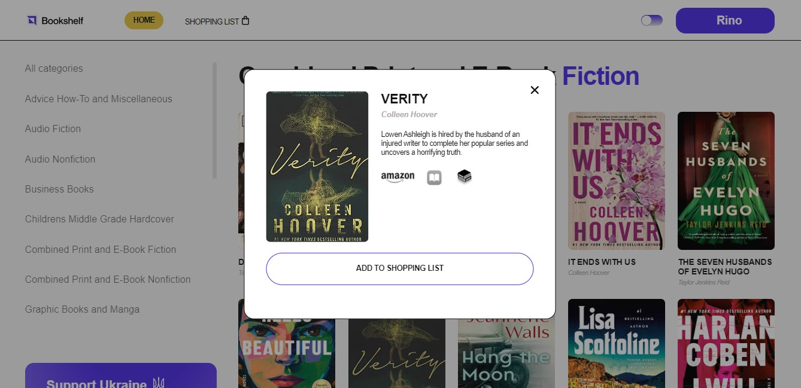

# 𝔹𝕠𝕠𝕜𝕤𝕙𝕖𝕝𝕗



This group project was created using [Parcel](https://parceljs.org/).    

The web app is designed for book shopping and allows the user to search for books by category and sort purchases into a shopping cart. There is also an opportunity to switch to one of three trading platforms on this topic. 

## 𝔽𝕖𝕒𝕥𝕦𝕣𝕖𝕤 𝕒𝕟𝕕 𝕋𝕖𝕔𝕙𝕟𝕠𝕝𝕠𝕘𝕚𝕖𝕤 ᎓  

</a>&nbsp;
  &nbsp;
  &nbsp;
  &nbsp;
  &nbsp;
  &nbsp;  
  
※ Realized registration.  
※ View a categories list of available books.  
※ Add selected books to the cart. 
※ Sidebar with support.   
※ Easy scrolling to the top.
※ Working with backend requests.
※ Libraries used: axios, basiclightbox, swiper, notiflix.

## 𝕀𝕟𝕤𝕥𝕒𝕝𝕝𝕒𝕥𝕚𝕠𝕟 ᎓  

To get started with this project, follow the installation instructions below.

1. Clone the repository:
   ```bash
   git clone https://github.com/Morifer79/code-jedi-project-02.git
   cd code-jedi-project-02-app
   ```
2. Install the dependencies:
   ```bash
   npm install
   ```
3. Start the development server:
   ```bash
   npm start
   ```
4. Open to view it in the browser:  
<a href="https://morifer79.github.io/code-jedi-project-02/"></a>

## 𝔼𝕞𝕒𝕚𝕝 𝕞𝕖 ᎓  
Questions, suggestions, help:  
<a href="mailto:cyber-morifer@proton.me"></a>
   
